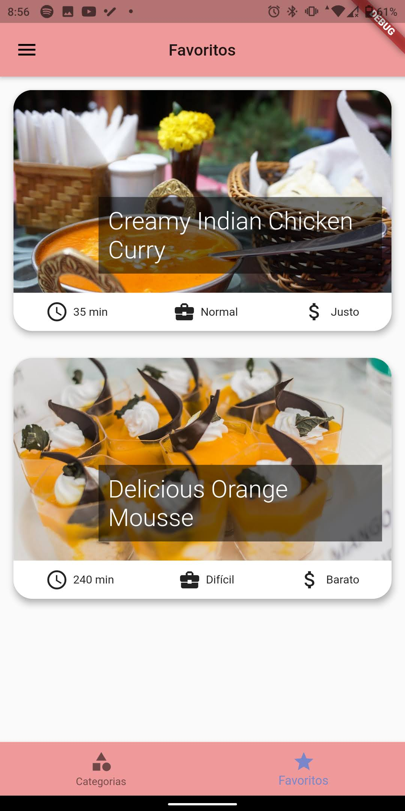

# Meals

An application in Flutter of culinary recipes of different flavors.

## What i learned

This project is my first small project using Flutter, with that i learned the use of routes and how to store data in the smartphone's memory.

## Usage

    

        Home page -> Categories -> Meal recipe
    

  

    

        The user can filter types of meals and create a favorite meals list
    

  

